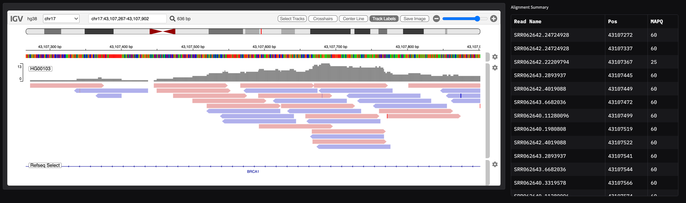

# gradio-igv
  

Embed IGV.js in your app to visualize genomics data.



## Installation

```bash
pip install gradio_igv
```

## Quickstart

Here is a quickstart to make an app which views a CRAM file in IGV and displays a table of the first 20 visible reads.

```python
import gradio as gr
from gradio_igv import IGV, IGVContext, AlignmentTrackLoad, FeatureContext, parse_locus
import pandas as pd


public_cram = "https://s3.amazonaws.com/1000genomes/data/HG00103/alignment/HG00103.alt_bwamem_GRCh38DH.20150718.GBR.low_coverage.cram"
default_igv_context = IGVContext(
    genome="hg38",
).update_locus("BRCA1").add_track(
    AlignmentTrackLoad(
        name="HG00103",
        url=public_cram,
        indexURL=f"{public_cram}.crai",
        order=1,
        height=200,
        colorBy="strand",
        oauthToken=None,  # Public file so no auth needed; otherwise inferred by URL type using environment
    )
)

def summarize_visible_alignments(igv_context):
    loci = parse_locus(igv_context.locus)
    feature_ctx = FeatureContext(
        files=[public_cram],
        names=["HG00103"],
        loci=loci,
    )

    reads = list(feature_ctx.features["HG00103"])
    df = pd.DataFrame({
        "Read Name": [read.query_name for read in reads],
        "Pos": [read.reference_start for read in reads],
        "MAPQ": [read.mapq for read in reads],
    }).sort_values(by='Pos')
    return df.head(20)

with gr.Blocks() as demo:
    with gr.Row():
        with gr.Column(scale=3):
            igv_component = IGV(value=default_igv_context, label="IGV Browser")
        with gr.Column(scale=1):
            alignment_summary = gr.DataFrame(value=pd.DataFrame(), label="Alignment Summary", max_height=800)

    igv_component.locuschange(summarize_visible_alignments, [igv_component], [alignment_summary])

if __name__ == "__main__":
    demo.launch()
```

## Usage

The library contains a few fundamental classes that work together to manipulate the IGV.js instance in your app.

### IGV

This is the main component that you will use to embed IGV.js in your app. It takes an `IGVContext` object as input and returns an `IGVContext` object as output. The `IGVContext` object is used to configure the IGV instance.

### IGVContext

This object is used to configure the IGV instance. It should be initialized using a choice of reference genome (generally either `hg19` or `hg38`, but you can also use the `ReferenceGenome` object to link to a custom fasta). You can then update the locus, add tracks, and configure the IGV instance using the following methods:
- `update_locus`: Update the current locus of the IGV instance using a string.
- `add_track`: Add a track to the IGV instance using a `TrackLoad` object.
- `remove_track`: Remove a track from the IGV instance using a string.
- `update_genome`: Update the reference genome of the IGV instance using a string or a `ReferenceGenome` object.

### TrackLoad

The `TrackLoad` class has multiple classes which inherit from it that are meant to be used to facilitate loading and configuring different tracks. The defaults used are meant to reflect those of IGV.js. The following classes are available:
- `AnnotationTrackLoad`: Load an annotation track using e.g. GFF, GTF, or BED file.
- `AlignmentTrackLoad`: Load an alignment track using a CRAM or BAM file.
- `VariantTrackLoad`: Load a variant track using a VCF or BCF file.

At the moment, these are the only types of tracks supported to upload. Feel free to open an issue if you have a use case for more!

To see the full customizable parameters, check the input fields and compare with the IGV.js documentation. Note that OAuth token generation should be handled automatically based on the URL provided if it lives in GCloud, Azure, or AWS and assuming your environment is configured appropriately to access the file.

### FeatureContext

This is a convenience object you can create using the same filenames and loci as the `IGVContext` to fetch features from the files. This is useful for fetching features from the files that are currently visible in the IGV instance, like in the Quickstart example above. It works well with the `parse_locus` method as in the Quickstart example. The `features` attribute is a dictionary of lists of features, where the keys are the names provided for each file and the values are iterables over the visible features. This uses `pysam` under the hood for the genomics files IO.

## Recipes

Be sure to check out the recipes directory for more full examples of how to use the library, along with some tools that might be useful, including:
- [SV-Breakpoint-Visualizer](recipes/SV-Breakpoint-Visualizer/README.md): A tool to visualize structural variant breakpoints in IGV with statistics on reads covering the edges.