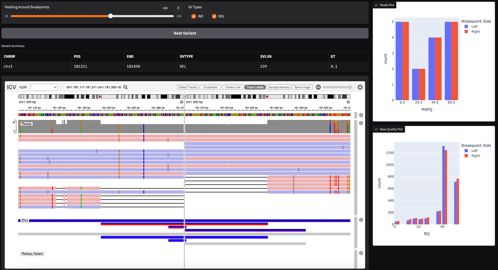

# SV Breakpoint Visualizer

This is a recipe for a small app that can help plot some statistics about SV breakpoints while visualizing the read and variant data.



## Usage

This app is designed to be used with a VCF file and a BAM file. The VCF file should contain the structural variant calls and the BAM file should contain the reads. The app will plot the mapping quality of reads around the breakpoints along with the distribution of base qualities in the visible IGV window.

First, make sure you have `gradio_igv` installed, as well as [plotly](https://plotly.com/python/). Then run the following in this directory:

```bash
python sv_breakpoint_visualizer.py --vcf-file <YOUR_SV_VCF_FILE> --bam-file <YOUR_BAM_FILE> --insertion-types <INSERTION_TYPES> --sv-types <SV_TYPES> --start-at <START_AT>
```

You should use a comma-delimited list for `insertion-types` and `sv-types`. The former will collect types that should be treated as novel sequences inserted, like `INS`, `DUP`, etc. These will not use the split-screen view in IGV when visualizing the breakpoints, since there is only one reference locus of interest. The `sv-types` will provide the list of types of SVs to visualize (default = "INS,DEL"). For example, this can be used to completely ignored `BND`, etc. While using the app, you can use the checkbox to select which of these types should be considered when pressing the "Next Variant" button.

The `start-at` parameter can be used to skip to a specific locus in the VCF file (format: `chrom:pos`). The app will automatically look for the next variant after that position. Note an error may be thrown if there are no more variants on that contig in the VCF at the given position.

The app will launch in your browser and you can interact with the IGV instance to see the statistics update in real-time. The top two controls can configure how wide a window around each breakpoint to display in IGV (the slider) and which SV types should be considered vs skipped.

Once the top two controls are to your liking, press the "Next Variant" button to jump to the next variant in the SV file. This will populate the "Variant Summary" table with some characteristics of the variant, namely the "CHROM", "POS", "END", "SVTYPE", "SVLEN", and "GT" (for the first sample). You should be sure that all entries in your SV VCF have these fields.

Below that, the IGV browser will jump to the next variant, potentially splitting the view if needed to see both breakpoints. The visible reads will have their mapping quality distribution filled on the right, as well as the base quality distribution. The distributions will be colored by left vs right breakpoints if applicable.

